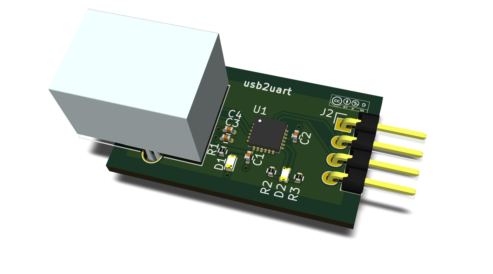
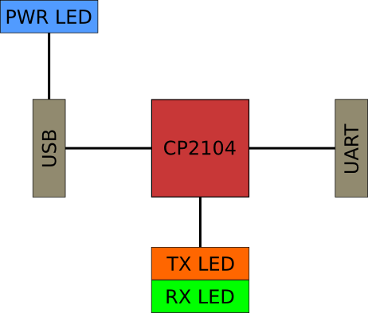

## USB2UART: open hardware USB to UART converter

---

Schematic and layout of a USB to UART converter printed circuit board. Material for a tutorial on KiCAD.

### USB2UART is a USB to basic 3.3V UART converter with the following features:

* Based on the CP2104 integrated circuit from Silicon Labs.
* Supported out of the box in most modern operating systems as a virtual serial port.
* Provides a standard type B connector on the USB side, and a four-pin header on the UART side.
* Includes a power status indication LED and an RX/TX activity indication LED.
* Implemented as a two-layer PCB using the [KiCAD EDA software suite](http://www.kicad-pcb.org).
* Open hardware.

---

### Block diagram

---

### File list

* **README.md:** this file
* **usb2uart.pro:** top-level KiCAD project
* **usb2uart.sch:** schematic
* **usb2uart.pdf:** schematic exported to PDF
* **usb2uart.lib:** library of custom symbols
* **usb2uart-cache.lib:** cached library of all used symbols
* **usb2uart.dcm:** symbol doc library
* **usb2uart.net:** netlist
* **usb2uart.kicad_pcb:** PCB layout
* **usb2uart.csv:** bill of materials (BOM)
* **usb2uart.pretty/:** library of custom footprints
* **contrib/:** contributed 3d models. Many thanks to [Walter](http://smisioto.no-ip.org/elettronica/kicad/kicad-en.htm) for providing his work under the [CC-BY-SA 3.0](http://creativecommons.org/licenses/by-sa/3.0/)
* **datasheets/:** datasheets for all used components
* **images/:** various images
* **mfg/usb2uart.drl:** Excellon CNC drilling file
* **mfg/usb2uart-all.pos:** SMD component placement for pick-n-place machines
* **mfg/gerber/:** Gerber files

---

### Copyright and License

**© 2014-2015 Logikon Labs.**

**All design and manufacturing files are available under the [Creative Commons Attribution-ShareAlike 4.0 International License](http://creativecommons.org/licenses/by-sa/4.0/).**

**To view a copy of this license, visit http://creativecommons.org/licenses/by-sa/4.0/.**

