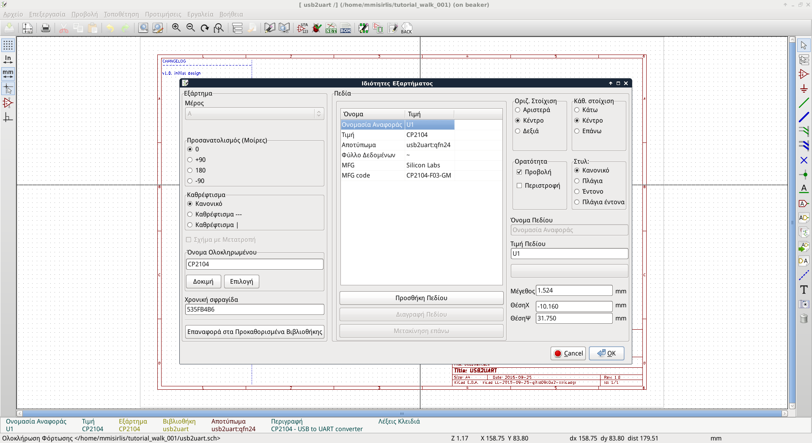

# Ταυτότητα έργου KiCad_EDA_Greece
Προώθηση του free, open source προγράμματος KiCad στους έλληνες χρήστες με χρήση open hardware.

## Github σύνδεσμος
[https://github.com/ellak-monades-aristeias/KiCad_EDA_Greece](https://github.com/ellak-monades-aristeias/KiCad_EDA_Greece) 

## Οθόνη Ελληνικού περιβάλλοντος KiCad

## Περιγραφή έργου
Αυτό το έργο  έχει ως σκοπό την προώθηση του λογισμικού [Kicad](http://kicad-pcb.org/) στους Έλληνες χρήστες. Αυτό γίνεται υλοποιώντας τις παρακάτω τρεις ενέργειες.

* Πλήρης εξελληνισμός του περιβάλλοντος του KiCad
* Ανάπτυξη μίας απλής ηλεκτρονικής συσκευής ανοιχτού υλικού με το KiCad 
* Συγγραφή ενός οδηγού εκμάθησης (tutorial) χρήσης του KiCad στα Ελληνικά χρησιμοποιώντας την ηλεκτρονική συσκευή ανοιχτού υλικού ως βάση

## Σε ποιους απευθύνεται το έργο
Το εξελληνισμένο λογισμικό ηλεκτρονικής σχεδίασης KiCad μαζί με το ελληνικό tutorial μπορεί να φανεί χρήσιμο σε άτομα, οργανισμούς και επιχειρήσεις οι οποίοι θέλουν να μπορούν να σχεδιάσουν ηλεκτρονικά κυκλώματα και πλακέτες για προσωπικούς, επαγγελματικούς, και εκπαιδευτικούς λόγους. 
Σαν παράδειγμα χρηστών σε κάθε κατηγορία μπορούν να σημειωθούν οι χομπίστες ηλεκτρονικών, οι νεοφυείς επιχειρήσεις με περιορισμένους πόρους, και τα σχολεία ή ΤΕΙ.

## Ελάχιστες απαιτήσεις (προαπαιτούμενα)
Οι ελάχιστες απαιτήσεις για χρήση του εξελληνισμένου περιβάλλοντος KiCad είναι το λογισμικό KiCad (έκδοση 4.0). Το KiCad τρέχει σε οποιονδήποτε υπολογιστή που τρέχει ένα από τα υποστηριζόμενα λειτουργικά συστήματα.
Για τον οδηγό εκμάθησης (tutorial) χρήσης του KiCad η μόνη απαίτηση είναι ένα πρόγραμμα προβολής αρχείων pdf. Για τη συσκευή ανοιχτού λογισμικού απαιτείται επίσης το λογισμικό KiCad.

## Άδεια χρήσης και πνευματικά δικαιώματα

Το περιεχόμενο αυτού του έργου κυκλοφορεί κάτω από άδειες EUPL v1.1 και CC-BY-SA 4.0.

**Για να δείτε το περιεχόμενο αυτών των αδειών επισκεφθείτε τα  http://creativecommons.org/licenses/by-sa/4.0/deed.el και http://ec.europa.eu/idabc/eupl.html**
